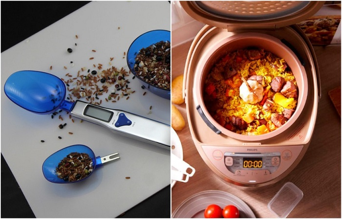
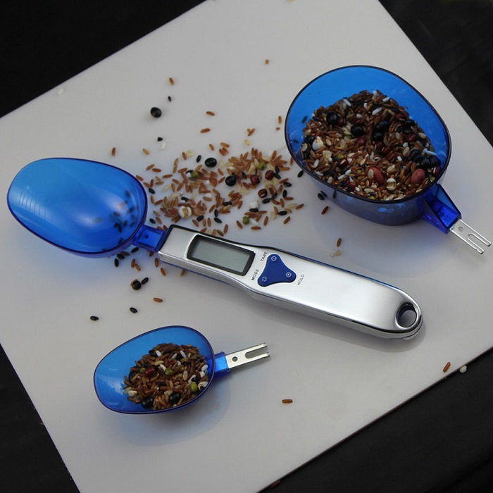
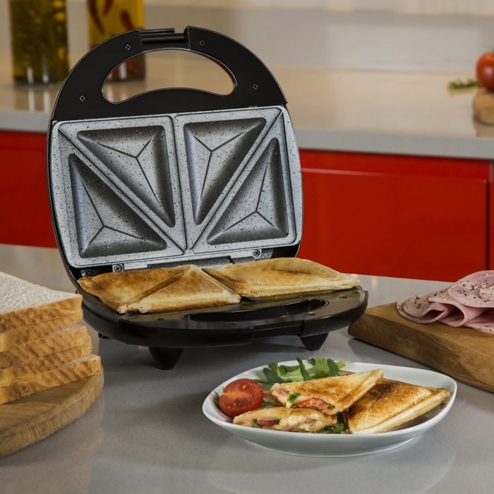
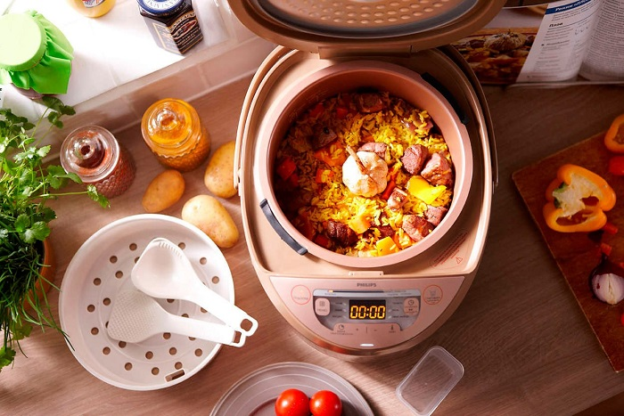
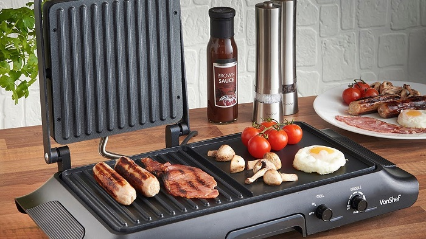

# Kitchen gadgets that make a great gift for those who keep up with the times

Modern manufacturers do everything possible to make staying in the kitchen as comfortable as possible and cooking - simple and fast. The proof of this is a list of gadgets, presented in the article Novate.ru. Each of the presented gadgets will help to create masterpieces not worse than restaurant ones, as well as allow you to fall in love with cooking with all your heart.

 ## Measuring spoon with digital display

"Smart" device is sure to please avid cooks, especially those who love pastry art. It guarantees maximum accuracy of food doses, and therefore can safely replace electronic scales and cups with divisions. With a spoon, you can weigh any kind of products: flour, sugar, salt, butter, milk, cream, and so on. The maximum weight the spoon can show is 300 grams, which is pretty impressive. The gadget displays the measure of weight in grams, ounces, grains and carats. There is a scale for liquids on the spoon - you can measure from 5 to 30 ml.

 ## Sandwich Maker

If you can't live a day without hot sandwiches, then the sandwich maker will be an essential item in your kitchen. Its main advantage is that the bread with the filling inside is evenly fried on both sides without the use of oil. There is also no need to turn the sandwich. Most such gadgets are designed for four sandwiches, which means you can prepare a delicious breakfast for the whole family at once. The process of cooking itself takes two to three minutes, which is a great time saver.

 ## Multicooker

Multicooker can replace several useful devices at the same time and cook a variety of dishes, from pie, porridge, and ending with soup, fried potatoes. At the same time, your participation in the cooking process is practically not required. All you need to do is to put in the multicooker products specified in the recipe, select the desired program ("Baking", "Frying", etc.) and go about your business. Device independently sets the timer depending on the program you choose, and after time passes to the mode of heating, so your dish will be hot until lunch or dinner.

 ## Electric Grill

Another simple and versatile kitchen appliance is the electric grill, which is designed to bake, roast, and heat food. You can use the device to cook meat, fish and vegetables like a charcoal grill, as well as heat up sandwiches or toast bread for future sandwiches. The electric grill has many advantages: it has non-stick coating, so you can fry food without oil, knows how to maintain the set temperature, heats the dish evenly on both sides, so there is no need to turn it.

